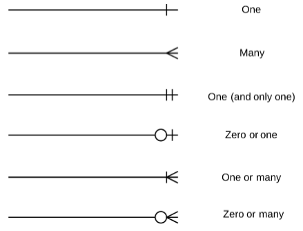

# Basic 2주차 자료 정리 - 데이터베이스

---

## 데이터베이스의 개념과 특징 및 종류, 그리고 DBMS의 등장 배경

### 1. 데이터베이스(Database) 란
> **전자적으로 저장되고 체계적인 데이터 모음**  
> 단어, 숫자, 이미지, 비디오, 파일 등 모든 유형의 데이터 포함

#### 1-1. 데이터 베이스의 필요성 및 특징
- **효율적인 확장성**: 대량 데이터 관리 가능  
- **데이터 무결성**: 일관성을 유지하는 규칙 제공  
- **데이터 보안**: 개인정보 보호 및 규정 준수  
- **데이터 분석 기능**  
- **백업 및 복구 지원**  
- **데이터 중복 최소화 (정규화)**

#### 1-2. 데이터베이스의 종류

- 관계형 데이터베이스 (Relational DB)  
- 비관계형 데이터베이스 (NoSQL)  
- 계층형 데이터베이스 (Hierarchical DB)  
- 네트워크형 데이터베이스 (Network DB) 

### 2. DBMS의 등장 배경
> **DBMS (Database Management System)**: 데이터를 관리하는 소프트웨어

#### 과거 파일 시스템의 한계

- **데이터 중복**  
  같은 정보가 여러 파일에 중복 저장됨

- **데이터 무결성 문제**  
  한쪽은 수정되었지만 다른 파일은 수정되지 않아 불일치 발생

- **데이터 검색/수정이 어려움**  
  파일을 직접 열어서 수작업으로 처리해야 함

- **동시 접근 불가능**  
  여러 사용자가 동시에 접근하면 충돌 발생

→ 이를 해결하기 위해 DBMS가 등장, SQL 같은 언어를 통해 데이터를 효율적으로 관리.

---

## SQL과 NoSQL의 개념 및 차이점

### 1. RDBMS와 SQL의 차이
> **RDBMS**: 관계형 데이터베이스 관리 시스템 (MySQL, PostgreSQL 등)   
> **SQL**: Structured Query Language, RDBMS에서 **데이터를 정의하고 조작하는 언어**

### 2. SQL과 NoSQL의 개념

#### **[ SQL ]**
- 구조: 고정된 스키마, 테이블 기반  
- 특징: 정형 데이터, 수직 확장  
- 예시: MySQL, Oracle  
- 트랜잭션의 4대 특성(ACID)

      - 원자성(Atomicity): 트랜잭션의 작업은 모두 수행되거나, 전혀 수행되지 않아야 한다.

      - 일관성(Consistency): 트랜잭션 수행 전후에 데이터의 제약 조건이 항상 유지되어야 한다.

      - 독립성(Isolation): 여러 트랜잭션이 동시에 실행되더라도 서로 간섭하지 않아야 한다.

      - 지속성(Durability): 트랜잭션이 성공적으로 완료되면, 그 결과는 영구적으로 저장되어야 한다.

#### **[ NoSQL ]**
- 구조: 유연한 스키마
- 종류:
  - 문서형(Document-based): JSON 구조로 데이터 저장 (MongoDB)
  - 키-값(Key-Value): 단순한 매핑 구조 (Redis)
  - 그래프형(Graph): 노드-엣지 기반 (Neo4j)
  - 컬럼형(Column-oriented): 열 기반 저장 (Cassandra)
- 특징: 비정형 데이터, 수평 확장, 대용량 처리에 적합 
- 예시: MongoDB, Redis, Cassandra, Neo4j

#### SQL vs NoSQL 요약

| 항목 | SQL | NoSQL |
|------|-----|--------|
| 구조 | 테이블 기반 | 문서, 키-값 등 |
| 스키마 | 고정 스키마 | 유연한 스키마 |
| 확장성 | 수직 확장 | 수평 확장 |
| 데이터 유형 | 정형 데이터 | 비정형 데이터 |
| 예시 | MySQL, Oracle | MongoDB, Redis |

### 3. 사용 사례

- **SQL 적합**
  - 데이터 간의 관계가 복잡하고 JOIN이 많은 시스템
  - 정합성과 무결성 유지가 중요한 시스템 (은행, 병원)
  - 구조가 고정되어 있는 시스템
  - 수직 확장(서버 성능 업그레이드) 용이
  - 중간 규모 데이터 처리 

- **NoSQL 적합**
  - 데이터 간의 관계가 거의 없거나 단순한 시스템
  - 속도와 유연성이 중요한 시스템
  - 구조가 자주 바뀌는 시스템
  - 수평 확장(서버 여러 대로 분산) 용이
  - 대규모 데이터 처리

---

## SQL의 기본 문법

### 1. DDL, DML, DCL, TCL 이란

- **DDL (Data Definition Language)**: 데이터 구조 정의어
  - `CREATE`, `ALTER`, `DROP`, `RENAME`, `TRUNCATE`
- **DML (Data Manipulation Language)**: 데이터 조작어
  - `SELECT`, `INSERT`, `UPDATE`, `DELETE`
- **DCL (Data Control Language)**: 데이터 제어어
  - `GRANT`, `REVOKE`
- **TCL (Transaction Control Language)**: 트랜잭션 제어어
  - `COMMIT`, `ROLLBACK`, `SAVEPOINT`

#### 예시 쿼리
```sql
-- DDL
CREATE TABLE students ( -- 테이블 생성
    id INT PRIMARY KEY,
    name VARCHAR(50),
    age INT
);
ALTER TABLE students ADD email VARCHAR(100); -- 테이블 수정(컬럼 추가)
DROP TABLE students; -- 테이블 삭제
RENAME TABLE students TO users; -- 테이블 이름 변경
TRUNCATE TABLE students; --테이블의 모든 데이터 삭제(구조는 유지)


-- DML
SELECT name, age FROM students; -- 데이터 조회
INSERT INTO students (id, name, age) VALUES (1, 'Alice', 22); -- 데이터 삽입
UPDATE students SET age = 23 WHERE id = 1; -- 데이터 수정
DELETE FROM students WHERE name = 'Alice'; -- 데이터 삭제


-- DCL
GRANT INSERT ON students TO 'user1'@'localhost'; -- 테이블에 대한 권한 부여
REVOKE INSERT ON students FROM 'user1'@'localhost'; -- 테이블에 대한 권한 회수
```

### 2. 트랜잭션(Transaction)이란

> 하나의 작업 단위를 의미
>  
> 여러 개의 쿼리들이 모여 **모두 성공하거나, 모두 실패**해야 하는 논리적 작업 묶음

- 예시 상황: 은행 송금 시스템
```sql
START TRANSACTION;
UPDATE accounts SET balance = balance - 1000 WHERE id = 1;
UPDATE accounts SET balance = balance + 1000 WHERE id = 2;
COMMIT;  -- 또는 ROLLBACK;
```

---

## ERD (Entity-Relationship Diagram)란 

### 1. ERD란
> ERD(Entity-Relationship Diagram)는 데이터베이스 구조를 **시각적으로 표현한 다이어그램**
>
> 데이터베이스 설계 전에 구조를 시각적으로 이해하기 위해 사용
>
> 테이블 간 관계를 명확히 표현해 협업이나 개발에 도움

#### 1-1. ERD의 요소
- **Entity(엔티티)**: 테이블이 될 개체 (예: User, Product)
- **Attribute(속성)**: 엔티티에 속한 정보 (예: id, name, price)
- **Relationship(관계)**: 엔티티 간의 연결 (예: 1:1, 1:N, N:M 등)
- **Primnary Key(PK)**: 엔티티 고유하게 식별하는 속성
- **Foreign Key (FK)**: 다른 엔티티를 참조하는 속성

### 2. ERD 표기법
IE/Crow's Foot 방식이 가장 보편적으로 사용

- **Identifying(식별 관게)**: 부모 Entity 의 키를 자식 Entity 의 **기본키**로 사용
> 자식 Entity 는 부모 Entity 가 존재해야 존재할 수 있음
- **Non-Identifying(비식별 관계)**: 부모 Entity 의 키를 자식 Entity 의 **외래키**로 사용
> 자식 Entity 는 부모의 존재유무와 관계 없이 독립적으로 존재할 수 있음

<p align="center">
 
</p>

---